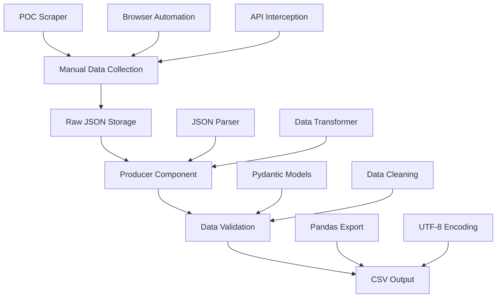

# Design Document

## Overview

The PowerBuy Scraper Implementation is designed as a two-component system: a manual data collection tool (based on the existing POC) and an automated producer component that processes raw JSON data into clean CSV output. This hybrid approach reduces complexity while maintaining reliability, allowing for manual control over data collection timing and automated processing for consistent output quality.

The system leverages the successful POC architecture that demonstrated API interception capabilities, extending it with a robust data processing pipeline that can handle variable product data structures and deliver business-ready CSV files.

## Architecture

### High-Level System Flow



### Component Architecture

The system follows a modular design with clear separation between data collection and processing:

1. **Manual Collection Layer**: Enhanced POC scraper for controlled data gathering
2. **Storage Layer**: Organized JSON file storage with metadata
3. **Processing Layer**: Producer component with validation and transformation
4. **Output Layer**: Clean CSV generation with business formatting

## Components and Interfaces

### 1. Enhanced POC Scraper (Manual Collection)

**Purpose**: Extends the existing POC to support organized data collection and storage

**Key Features**:
- Configurable search terms from a list
- Automatic JSON response capture and storage
- Organized file naming with timestamps
- Progress tracking and error logging

**Interface**:
```python
class ManualCollector:
    def collect_search_data(self, search_terms: List[str]) -> Dict[str, str]
    def collect_individual_product(self, product_url: str) -> Dict
    def save_raw_data(self, data: Dict, filename: str) -> None
    def get_collection_summary(self) -> CollectionSummary
```

### 2. Producer Component (Automated Processing)

**Purpose**: Processes raw JSON data into clean, validated CSV output

**Key Features**:
- Batch processing of JSON files
- Flexible JSON structure handling
- Data validation and cleaning
- CSV export with business formatting

**Interface**:
```python
class DataProducer:
    def load_raw_data(self, input_directory: str) -> List[Dict]
    def process_products(self, raw_data: List[Dict]) -> List[ProductData]
    def validate_data(self, products: List[ProductData]) -> List[ProductData]
    def export_csv(self, products: List[ProductData], output_path: str) -> None
```

### 3. Data Storage Organization

**Raw Data Structure**:
```
raw_data/
├── search_results/
│   ├── iphone_2025-07-28_14-30-15.json
│   ├── samsung_2025-07-28_14-35-22.json
│   └── metadata.json
├── individual_products/
│   ├── product_12345_2025-07-28.json
│   └── product_67890_2025-07-28.json
└── processed/
    └── competitor_prices_2025-07-28.csv
```

## Data Models

### Core Data Structures

```python
from pydantic import BaseModel, validator
from typing import Optional, List
from datetime import datetime

class RawProductData(BaseModel):
    """Raw product data from PowerBuy API"""
    name: str
    sku: str
    price: Optional[str]  # Raw price string from API
    stock_status: Optional[str]
    raw_json: dict  # Complete original JSON for debugging

class ProductData(BaseModel):
    """Validated and cleaned product data"""
    name: str
    sku: str
    price_thb: float
    stock_status: str
    
    @validator('price_thb')
    def validate_price(cls, v):
        if v < 0:
            raise ValueError('Price cannot be negative')
        return round(v, 2)
    
    @validator('stock_status')
    def normalize_stock_status(cls, v):
        if v.lower() in ['in stock', 'available', 'มีสินค้า']:
            return 'In Stock'
        elif v.lower() in ['out of stock', 'unavailable', 'หมด']:
            return 'Out of Stock'
        return 'Unknown'

class CollectionSummary(BaseModel):
    """Summary of manual collection session"""
    search_terms_processed: List[str]
    total_products_found: int
    files_created: List[str]
    errors: List[str]
    collection_time: datetime
```

## Error Handling

### Collection Phase Error Handling

1. **Network Errors**: Retry with exponential backoff
2. **API Response Errors**: Log and continue with next search term
3. **Browser Automation Errors**: Screenshot capture and graceful recovery
4. **File System Errors**: Alternative storage paths and error logging

### Processing Phase Error Handling

1. **JSON Parsing Errors**: Skip malformed files with detailed logging
2. **Data Validation Errors**: Exclude invalid products but continue processing
3. **CSV Export Errors**: Fallback to alternative formats and encoding
4. **Missing Data Fields**: Use default values or mark as unavailable

### Error Recovery Strategies

```python
class ErrorHandler:
    def handle_collection_error(self, error: Exception, context: str) -> bool
    def handle_processing_error(self, error: Exception, product_data: dict) -> Optional[ProductData]
    def log_error(self, error: Exception, context: str, severity: str) -> None
    def generate_error_report(self) -> ErrorReport
```

## Testing Strategy

### Unit Testing

1. **Data Model Validation**: Test Pydantic models with various input scenarios
2. **JSON Processing**: Test parser with different PowerBuy API response formats
3. **Data Transformation**: Test price parsing and stock status normalization
4. **CSV Export**: Test output formatting and encoding

### Integration Testing

1. **End-to-End Flow**: Test complete pipeline from raw JSON to CSV
2. **File System Operations**: Test file reading, writing, and organization
3. **Error Handling**: Test recovery mechanisms with simulated failures
4. **Data Quality**: Test validation rules with edge cases

### Manual Testing

1. **Collection Tool**: Test manual scraper with different search terms
2. **Browser Automation**: Test stealth features and anti-detection
3. **User Experience**: Test ease of use for manual data collection
4. **Output Quality**: Validate CSV format meets business requirements

## Implementation Considerations

### Performance Optimization

- **Batch Processing**: Process multiple JSON files in single operation
- **Memory Management**: Stream large datasets to avoid memory issues
- **Caching**: Cache validated data models to avoid reprocessing
- **Parallel Processing**: Use asyncio for concurrent JSON file processing

### Scalability Considerations

- **File Organization**: Hierarchical storage for large datasets
- **Data Archiving**: Automatic cleanup of old raw data files
- **Configuration Management**: External config files for search terms and settings
- **Monitoring**: Built-in metrics for collection and processing performance

### Security and Privacy

- **Data Sanitization**: Remove any sensitive information from raw data
- **File Permissions**: Secure storage of raw data files
- **Logging Security**: Avoid logging sensitive data in error messages
- **Data Retention**: Configurable retention policies for raw data

## Deployment and Operations

### Development Environment Setup

```bash
# Virtual environment setup
python -m venv venv
source venv/bin/activate  # or venv\Scripts\activate on Windows

# Dependencies installation
pip install playwright pydantic pandas beautifulsoup4
playwright install chromium

# Project structure creation
mkdir -p raw_data/{search_results,individual_products,processed}
mkdir -p src/{collectors,producers,validators}
```

### Production Deployment

1. **Environment Configuration**: Set up production paths and settings
2. **Dependency Management**: Lock dependency versions for stability
3. **Monitoring Setup**: Configure logging and error reporting
4. **Backup Strategy**: Regular backup of raw data and processed results

### Operational Procedures

1. **Daily Collection**: Manual process for gathering fresh data
2. **Automated Processing**: Scheduled processing of collected data
3. **Quality Assurance**: Regular validation of output data quality
4. **Maintenance**: Periodic cleanup and system health checks